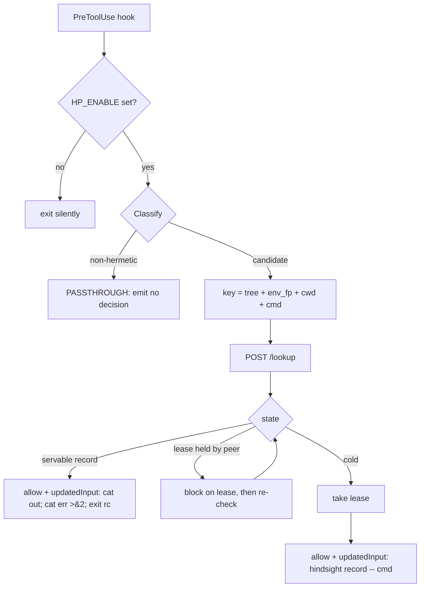

# Hindsight — build plan

**A build cache for coding agents.** Four hours, two people, Go, one static binary.

Read [AGENTS.md](AGENTS.md) first — it has the frozen contracts and the invariants. This file is the schedule and the reasoning. It changes as we go; AGENTS.md does not.

## The problem

Fan out five coding agents on one task in five git worktrees, and each one independently installs the same dependencies, runs the same failing test to reproduce the bug, and reads the same files. Nothing tells agent five that agent two already paid for it. In a large repo with a slow test suite, that duplicated work is the dominant cost of running agents in parallel.

## What we're building

A PreToolUse hook intercepts every shell command an agent runs, keys it on git's own Merkle hash of the workspace plus an environment fingerprint, and if a peer already ran that exact command at that exact state, rewrites the command to return the recorded result instead of executing it.

Nothing is predicted. A served result is a verified replay of something that actually happened, so the failure mode is a cache miss, never a wrong answer. There is no model anywhere in the system, and that is the point.

The pitch is subtraction, not speed: execution-seconds deleted, work paid for once and provably not paid for again.

## Why it's credible

The overlap this exploits is structural and measured on our own corpus (`skunk-works/notes/sealed-corpus/replay-A`: 25 SWE-bench tasks, 3-26 agents each). Agents start byte-identical and diverge monotonically.

- 26.5% cross-agent command overlap in the first 3 commands
- 24.3% in the first 5, 19.2% in the first 10
- 11.0% after step 10

All of these have been re-derived from the corpus independently, not taken on trust. Value is heavily concentrated: test suites are 8.1% of hits but 55.6% of the deleted seconds, while file reads are 16.8% of hits and 1.5% of the value. Roughly 4% of hits carry 92% of the value.

Caveat we state out loud: the *hit counts* are measured, the *seconds* come from a per-class cost model with hardcoded constants (`install=45s`, `suite=90s`). The live demo counter must use real durations from the fleet run, which is why the baseline control arm matters so much.

## Design principles

1. **Default is PASSTHROUGH.** Anything unmatched, unparseable, or unfamiliar runs normally. A classification bug costs a hit, never a wrong answer.
2. **The key must dominate the output.** Anything that can change what a command prints is in the key, or the command is not served.
3. **Share the map, not the route.** Agents inherit what's *here* — what tests say, what files contain. They never inherit each other's fix. Deduping mutations would collapse the search you paid five agents for.
4. **Effects, not calls.** Cache what the environment returned. Never cache what a model produced.
5. **Abstention over guessing.** Missing artifact, unknown class, stale env — all misses.
6. **Verify what you serve.** Shadow re-execute, diff, evict on divergence, keep the counter visible.

## The core design decision: a measured purity gate

The obvious approach is a static table classifying commands as pure reads / expensive reads / mutations. We do something better and simpler.

Record `(tree_hash, env_fingerprint)` **before and after** every command. A record is servable only if both are unchanged.

This one mechanism replaces the whole table:

- Catches `tsc` (emits `.js` by default), `cargo test` (writes `target/`), `go test -c` — every "read" that isn't actually a read. These change `tree_after`.
- Catches `uv sync` and `pip install`. `.venv` is gitignored so the tree hash cannot see it, but the env fingerprint can. Install commands therefore fall to PASSTHROUGH automatically, which removes our single most likely on-stage failure by construction rather than by remembering to handle it.
- Costs about 40 ms per command, both hashes warm.

It turns "default is PASSTHROUGH" from a guess into a measurement. The static classifier then has exactly two jobs it cannot delegate:

1. **The non-hermeticity deny-list.** `date`, `curl`, `$RANDOM`, `git push`, `uuidgen`, `hostname`. These are pure *by state* and still wrong to serve, because state hashing is blind to nondeterminism. This list is correctness, not polish, and it is never dropped for time.
2. A cheap pre-filter so we don't record noise.

Policy values are `SERVE`, `RECORD_ONLY`, `PASSTHROUGH`. We never use the word "deny": in Codex, `permissionDecision: "deny"` blocks the tool call outright, and an agent that cannot run `curl` is broken.

## Lookup flow

**The lease is what makes a cold demo work.** Five agents launched simultaneously all run `uv sync` within a second of each other, so without an in-flight registry every one of them misses and the high-overlap opening — the best part of our data — yields nothing. With it: agent one takes the lease, agents two through five block instead of duplicating, and all four serve from agent one's result. Five agents, one install.

## Build order — Tom, the Go binary

Wall-clock estimates. Cut line at roughly 2h35m.

- **0:00 · 2 min · Rescue.** Copy the seed scripts and `hindsight-run-sheet.html` out of the ephemeral `/private/tmp/claude-501/.../scratchpad/` into `seed/`. That directory holds the only copy of the overlap analysis and does not survive a reboot. This is the first commit.
- **0:02 · 10 min · Freeze.** AGENTS.md contracts agreed and committed. Both of us read it, then work independently.
- **0:12 · 30 min · Hook rewrite — riskiest thing first.** `hindsight hook` reads stdin and emits a hardcoded `echo A` → `echo B` rewrite. First line is the `HP_ENABLE` kill switch. Two envelope builders (Codex and Claude are *not* byte-compatible — see AGENTS.md). Explicit `timeout` in both configs. Verify with `codex exec --dangerously-bypass-hook-trust` that the original command never ran. This is the only genuinely unverified assumption in the build; if it fails, we find out at minute 42, not hour 3.
- **0:42 · 25 min · The key.** `hindsight key` prints tree hash plus env fingerprint. Persistent side index resolved per worktree via `git rev-parse --git-dir`. `$HP_HOME` outside the tree. Env fingerprint from interpreter version, arch, `pyvenv.cfg`, and the sorted `site-packages/*.dist-info` listing — a readdir, about 1 ms, not `pip freeze`.
- **1:07 · 35 min · Record, store, daemon skeleton.** `hindsight record` execs the command, tees stdout and stderr separately, captures exit code and duration, recomputes `(tree, env_fp)` after, POSTs to the daemon. Daemon is the single writer for `log.jsonl`. Port the `run_bounded` semantics (process-group SIGTERM then SIGKILL with a 5 s grace, output bounding, monotonic clock) from `skunk-works/tools/yc_demo/replay_fleet_v3_rich.py:558` rather than reinventing them.
- **1:42 · 25 min · Hit path.** `/lookup` serves only records whose before and after state match. **This is the product** — agent two gets agent one's result without running it.
- **2:07 · 28 min · Single-flight.** `map[key]*lease` in the daemon. A miss takes a lease; a lookup on a leased key blocks, then re-checks; lease expiry or holder failure falls through to execute.

**Cut line. Everything above is a complete, honest cold-fan-out demo. If the clock dies here, we still have a product and the pitch is intact.**

- **2:35 · 10 min · Wire policy.** Call `Classify` and `Normalize`.
- **2:45 · 25 min · Counter and viewer integration.** SSE `/events`, execution-seconds-deleted from measured durations against the baseline arm.
- **3:10 · 25 min · Shadow verify.** Re-execute served hits in the background and diff **after** normalization — raw byte-diff false-positives on every pytest run because of durations, tmpdirs, and per-worktree absolute paths. Report raw-identical and normalized-identical separately. "Served 31 / verified 31 / 0 divergent" is the answer to "how do I know it's right?"
- **3:35 · Rehearse, and write `design_doc.md` properly with real numbers.**

Tier-1 diff-disjoint scoping, the class-C artifact guard, and `hindsight init` become design-doc-only sections. We say so in the doc rather than leaving them looking half-finished.

## Your track — parallel, zero file collisions

In priority order. Item 1 is the highest-leverage work available to either of us.

1. **`scripts/fleet.sh` and the baseline control arm.** Same repo, same five worktrees, hooks off, every command and duration logged. Without this the execution-seconds-deleted number is unfalsifiable and the first question we get kills it. `fleet.sh` takes a mode argument, and the `baseline` path needs nothing from Tom — you can build and validate the entire control arm before the binary exists.
2. **`internal/hp/policy.go` and `internal/hp/norm.go`**, plus a table test over ~40 commands including `date`, `curl`, `git push`, and the chain `ls && curl x` (which must be unservable — strictest segment wins). Both are pure functions behind a signature frozen in AGENTS.md, with no shared state. Port from the rescued `hindsight_key.py` (`purity_class`, `ENV_DENY_PREFIX`) and `twomachine/norm.py`.
3. **`web/viewer.html`** — two clocks, the execution-seconds-deleted counter, a provenance stamp on every served result. Build it against a fixture JSONL replaying the real SSE shape so it needs nothing from Tom until integration.
4. **Evidence pass.** Regenerate the overlap table from the rescued `vn2.py`, screenshot the counters, and apply the two doc corrections below.
5. **Stretch, only after 1 is done.** A second corpus from `experiential-labs/wmo-terminal-tasks-traces` (Apache-2.0, 6 MB, real tool-call-to-true-observation transitions). Gate it on a five-minute structural check first: our statistic is cross-agent overlap *within* a task, so if that corpus is one agent per task it cannot reproduce it and the work is a dead end. Two traps — their dataset card's own snippet says `wmh-` while the repo is `wmo-`, and the HF viewer is broken with a `CastError` because the repo mixes router-optimizer JSON in with the traces, so `hf_hub_download` the single `traces.otel.jsonl` rather than calling `load_dataset`.

## How we collaborate

Both push straight to `main`. Two people with file-disjoint ownership for four hours makes pull requests pure overhead. `git pull --rebase` before every push; it should never conflict, and if it does, one of us edited a file we don't own.

- **Land empty shells at minute 20.** Commit `policy.go` returning `PASSTHROUGH` for everything and `norm.go` as an identity function, and Tom wires both immediately. This moves integration from minute 150, where it is expensive and sometimes unrecoverable, to minute 20, where it costs nothing. It is the single highest-value thing we can do for each other.
- **`go.mod` is frozen after the first commit.** Stdlib only. Two agents running `go mod tidy` is a guaranteed conflict for no benefit.
- **Separate daemon ports.** 7777 and 7778 via `HP_DAEMON`.
- **Signature changes are spoken, not committed.** Anything in the frozen-contracts section of AGENTS.md changes by talking first.
- **`main` always builds.** Small commits, often.

## What we do not claim

The negatives are the credibility. Written honestly, in the doc, out loud.

- We do not claim "N× faster" without the measured baseline arm.
- We do not claim it prevents mistakes.
- We do not predict anything. There is no model in the system.
- The multi-developer case is untested; `replay-A` is independent attempts at one task, and it holds 265 records against a manifest describing 736 — roughly a third of its planned run.
- 11,687 is a deduplicated command count; the raw figure is 12,806. Pick one, say which, never mix them on a slide.
- Hindsight shares observations, never decisions. The route-sharing idea in `lucid-thoughts.md` is deliberately out of scope — and the transition corpus this cache emits is exactly the data that would let us attempt it safely later. It is the data engine for that idea, not a retreat from it.

Two corrections to carry over from the earlier draft:

- **Drop ρ = −0.252, p = 8.3e-77.** It appears in four notes but every one traces to a file that does not exist, and no script computes it. The Bazel argument — a dependency set is not a similarity — needs no correlation coefficient.
- **Label the value table as modelled**, per the caveat in the evidence section above.

## Prior art — Experiential Labs

They open-sourced trace-keyed retrieval in June and are now shipping a model gateway instead. Worth five minutes:

- **Adopt their leakage rule verbatim, with attribution** (Apache-2.0): only a real action with a subsequently observed response becomes a retrieval transition; generated predictions, simulator rollouts, teacher data and judgments cannot enter the index. It is the cleanest statement of what makes Hindsight un-hallucinatable.
- **Rehearse the collision line** so a judge never raises it first: *theirs replays one agent's environment offline and predicts; ours shares state across N agents live, keyed on git's own tree hash, and quotes.*
- Cite `optimizer.py:422` — `RouterOptimizationError("router evaluation plans must not contain fidelity cells")` — as external validation, not competitive intel. A team that wanted predicted environments to work built a fidelity metric and then forbade it, in code, from gating any decision. That is a revealed preference from people motivated to conclude the opposite.

Never say "turn your codebase into a world model." Say build cache.

## Verification checklist

- **Env fingerprint** — two worktrees, identical tree, different `.venv`; assert different keys. This is the regression test for the one hole that can make Hindsight wrong.
- **Concurrent worktrees** — five worktrees computing keys simultaneously; assert no index corruption and correct distinct keys.
- **Purity gate** — record a `tsc` run that emits, assert not servable. Record `uv sync`, assert not servable via the env fingerprint.
- **Single-flight** — two simultaneous lookups on a cold key; assert exactly one execution.
- **Fail-open** — malformed JSON, dead daemon, timeout; the original command runs in all three.
- **Deny-list** — table test over ~40 commands, including chains.
- **Hit correctness** — record, serve, re-execute for real, diff normalized. Wire this as a test first and a feature second.
- **End-to-end** — `fleet.sh` twice on one bug, hooks off then on, compare total execution-seconds.
